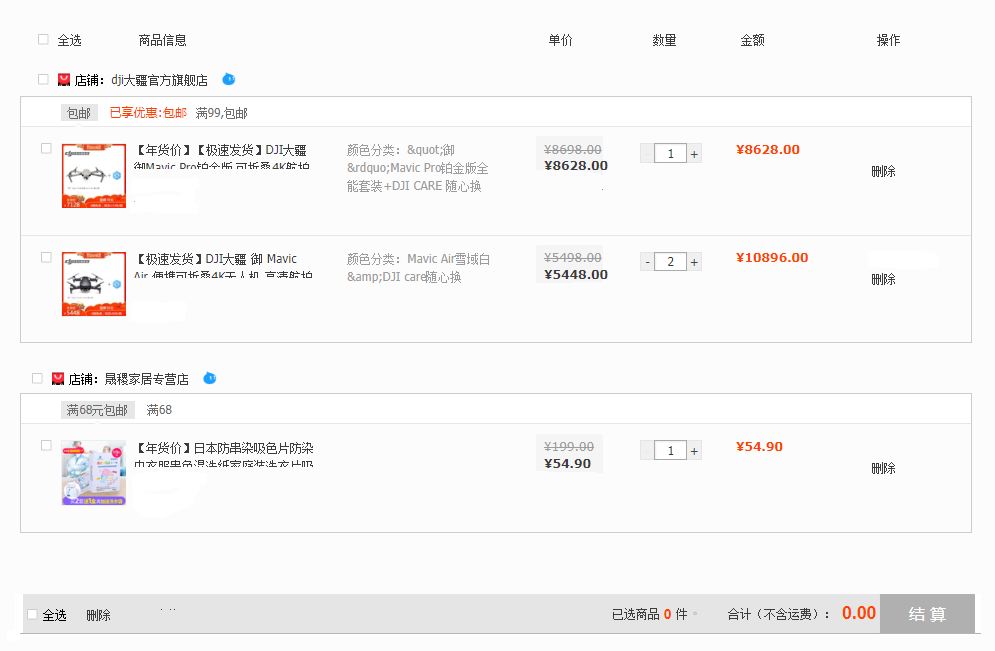

## 项目说明

### 1、页面

* 商品详情页面
* 购物车页面
* 商品列表页面

### 2、购物车页面

交互说明：

* 点击店铺名右侧的旺旺图标，跳转到旺旺（如何跳转参考淘宝）；
* 鼠标移动到图片上，显示大型图片；
* 点击商品名，跳转到商品详情页；
* 具体配置，纯显示不可更改；
* 数量可以点击按钮或者手动更改数量（最大不超过99）；
* 点击删除文字，跳出提示框，询问是否确认删除；
* 全选、店铺的复选框、商品的复选框，会联动；
* 价格，根据当前勾选的商品进行计算；
* 结算，会跳转到其他页面，显示具体商品信息、数量、价格。再返回购物车页面，之前被勾选的会清除；

